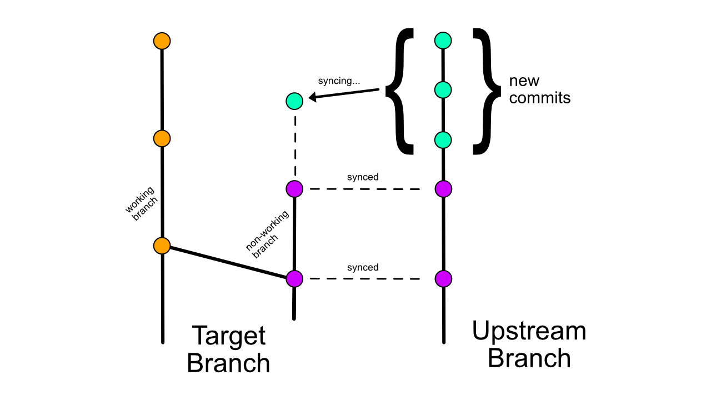

# Github Action: Upstream Sync

[Open in Visual Studio Code](https://open.vscode.dev/aormsby/Fork-Sync-With-Upstream-action)

## Limited Support

Please note that I am no longer actively working on this project. For the moment, I will continue curating fixes and updates, and I will consider merging your proposed PRs as long as they come with test support, well-documented changes, and have been thoroughly proven to work as expected. I've opened the Discussion tab on this repo, so please feel free to chat about anything there. Perhaps with enough interest we can continue development as a community. Thanks for using this Action. Happy coding.

## About

An action with forks in mind! Automatically sync a branch on your fork with the latest commits from the original repo. Keep things up to date!

**Bonus:** This action can also sync between branches on any two repositories. So you have options. :slightly_smiling_face:

**\*\*CHANGED in v3.4:\*\***
- Bump from `node12` to `node16`
- Update the ouptut command for `HAS_NEW_COMMITS`
- Fix incorrect token used during push step

<a href="https://www.buymeacoffee.com/aormsby" target="_blank"></a>

## Intended Workflow

This action was made to keep **non-working** branches up to date with a remote repo. However, you can probably use it for active work branches as well if the custom input supports your needs. Here's how it works.

You have a branch on your `target` repo - the one you want to update - and a branch on your `upstream` repo - where the updates are coming from. This action checks out those branches on both repos, checks for any new commits (by hash comparison), and pulls those new commits from upstream. Easy!



As stated, this works best if your target branch is a non-working branch - i.e. you don't make any commits to it. Check out the [wiki](https://github.com/aormsby/Fork-Sync-With-Upstream-action/wiki/Scenarios-for-Advanced-Input) for notes on how to use input vars for specific situations.

## How to Use

[Add a workflow](https://docs.github.com/en/actions/quickstart#creating-your-first-workflow) to your repo that includes this action ([sample below](#sample-workflow)). Please note that scheduled workflows only run on the default branch of a repo.

### Input Variables

**Note:** For clarity reasons, some variable names have been changed between v2 and v3. Please check your workflows for the correct input.

#### Core Use

| Name                       |     Required?      | Default | Example                                  |
| -------------------------- | :----------------: | ------- | ---------------------------------------- |
| target_sync_branch         | :white_check_mark: |         | 'master', 'main', 'my-branch'            |
| target_repo_token          | :white_check_mark: |         | ${{ secrets.GITHUB_TOKEN }}              |
| upstream_repo_access_token |                    |         | ${{ secrets.NAME_OF_TOKEN }}             |
| upstream_sync_repo         | :white_check_mark: |         | 'aormsby/Fork-Sync-With-Upstream-action' |
| upstream_sync_branch       | :white_check_mark: |         | 'master', 'main', 'my-branch'            |
| test_mode                  |                    | false   | true / false                             |

**Always** set `target_repo_token` to `${{ secrets.GITHUB_TOKEN }}` so the action can push to your target repo. ([wiki](https://github.com/aormsby/Fork-Sync-With-Upstream-action/wiki/Configuration#setup-notes))

This action supports syncing from both public and private upstream repos. Store an authentication token in your target repo and use `github_token: ${{ secrets.NAME_OF_TOKEN }}` as an input var for the action to access your private upstream repo.

#### Advanced Use (all optional args)

| Name                        |     Required?      | Default                     | Example                             |
| --------------------------- | :----------------: | --------------------------- | ----------------------------------- |
| host_domain                 | :white_check_mark: | 'github.com'                | 'github.com'                        |
| shallow_since               | :white_check_mark: | '1 month ago'               | '2 days ago', '3 weeks 7 hours ago' |
| target_branch_checkout_args |                    |                             | '--recurse-submodules'              |
| git_log_format_args         |                    | '--pretty=oneline'          | '--graph --pretty=oneline'          |
| upstream_pull_args          |                    |                             | '--ff-only --tags'                  |
| target_branch_push_args     |                    |                             | '--force'                           |
| git_config_user             |                    | 'GH Action - Upstream Sync' |                                     |
| git_config_email            |                    | 'action@github.com'         |                                     |
| git_config_pull_rebase      |                    | 'false'                     |                                     |

`shallow_since` -> Value should match the time between workflow runs to get the history depth required (but no more) for a good check of new commits to sync

##### Git Config Settings

Some basic git config settings must be in place to pull and push data during the action. As seen above, these inputs are required and have default values. They are reset when this action step is finished.

**Set any git config values to `null` to skip their configuration during this action step.**

### Output Variables

| Name            | Output     | Description                                                                                                     |
| --------------- | ---------- | --------------------------------------------------------------------------------------------------------------- |
| has_new_commits | true/false | Outputs true if new commits were found in the remote repo, false if target repo already has the latest updates. |

Want more output variables? [Open an issue](https://github.com/aormsby/Fork-Sync-With-Upstream-action/issues) and let me know.

## Sample Workflow

```yaml
name: 'Upstream Sync'

on:
  schedule:
    - cron:  '0 7 * * 1,4'
    # scheduled at 07:00 every Monday and Thursday

  workflow_dispatch:  # click the button on Github repo!

jobs:
  sync_latest_from_upstream:
    runs-on: ubuntu-latest
    name: Sync latest commits from upstream repo

    steps:
    # REQUIRED step
    # Step 1: run a standard checkout action, provided by github
    - name: Checkout target repo
      uses: actions/checkout@v3
      with:
        # optional: set the branch to checkout,
        # sync action checks out your 'target_sync_branch' anyway
        ref:  my-branch
        # REQUIRED if your upstream repo is private (see wiki)
        persist-credentials: false

    # REQUIRED step
    # Step 2: run the sync action
    - name: Sync upstream changes
      id: sync
      uses: aormsby/Fork-Sync-With-Upstream-action@v3.4
      with:
        target_sync_branch: my-branch
        # REQUIRED 'target_repo_token' exactly like this!
        target_repo_token: ${{ secrets.GITHUB_TOKEN }}
        upstream_sync_branch: main
        upstream_sync_repo: aormsby/Fork-Sync-With-Upstream-action
        upstream_repo_access_token: ${{ secrets.UPSTREAM_REPO_SECRET }}

        # Set test_mode true to run tests instead of the true action!!
        test_mode: true
      
    # Step 3: Display a sample message based on the sync output var 'has_new_commits'
    - name: New commits found
      if: steps.sync.outputs.has_new_commits == 'true'
      run: echo "New commits were found to sync."
    
    - name: No new commits
      if: steps.sync.outputs.has_new_commits == 'false'
      run: echo "There were no new commits."
      
    - name: Show value of 'has_new_commits'
      run: echo ${{ steps.sync.outputs.has_new_commits }}

```
