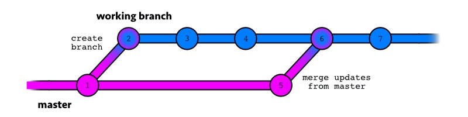

# Github Action: Fork Sync With Upstream

An action for forks! Automatically sync a branch on your fork with the latest commits from the original repo. Keep things up to date! (It actually works for syncing *any* repo branch with an upstream repo, but I was thinking about forks when I made it.)

<a href="https://www.buymeacoffee.com/aormsby" target="_blank"></a>

## Intended Workflow

This action is primarily intended to keep **untouched** branches up to date with a remote repo. So let's say you want to keep `main` updated with the upstream repo. You make a new branch `dev` (or whatever) and commit your new changes *there* - not on `main`. If you commit on `main`, you create a split history between your downstream and upstream changes, and any merge from upstream will fail. (This is just how git works.) But if you keep them separate and keep `main` clean, you can always pull the upstream's latest from `main`.

From there, you can make controlled merges into your active branches, make clean PRs directly from `main`, and pretty much do whatever you want with your smoothly updated branch!



(Pretend this says 'main' so I don't have to edit the image. Thanks.))

If you *really* want to make commits and merge from upstream on the same branch, I added some notes to achieve this below. This is not recommended, however.

## How to Use

As with any Github Action, you must include it in a workflow for your repo to run. Place the workflow at `.github/workflows/my-sync-workflow.yaml` in the default repo branch (required for scheduled jobs at this time). For more help, see [Github Actions documentation](https://docs.github.com/en/actions).

### Input Variables

#### Basic Use

| Name                | Required?           | Default           | Example |
| ------------------- |:------------------: | ----------------- | ----------
| upstream_repository | :white_check_mark:  |                   | aormsby/Fork-Sync-With-Upstream-action  |
| upstream_branch     | :white_check_mark:  |                   | 'master', 'main', 'dev'                 |
| target_branch       | :white_check_mark:  |                   | 'master', 'main', 'prod'                |
| github_token        |                     |                   | ${{ secrets.GITHUB_TOKEN }}             |

For **github_token** - use `${{ secrets.GITHUB_TOKEN }}` where `GITHUB_TOKEN` is the name of the secret in your repo ([see docs for help](https://docs.github.com/en/actions/configuring-and-managing-workflows/using-variables-and-secrets-in-a-workflow))

#### Advanced Use (all optional args)

| Name                   | Required?           | Default             | Example |
| ---------------------- |:------------------: | ------------------- | ----------
| git_checkout_args      |                     |                     | '--recurse-submodules'     |
| git_fetch_args         |                     |                     | '--tags'                   |
| git_log_format_args    |                     | '--pretty=oneline'  | '--graph --pretty=oneline' |
| git_pull_args          |                     | 'pull'              | '--ff-only'                |
| git_push_args          |                     |                     | '--force'                  |
| git_user               |                     | 'Action - Fork Sync'|                            |
| git_email              |                     | 'action@github.com' |                            |
| git_pull_rebase_config |                     | 'false'             |                            |

##### Git Config Settings

Some basic git config settings must be in place to pull and push data during the action process. The following input values are set by default:

- `git_user`
- `git_email`
- `git_pull_rebase_config` -> set the same as git default - 'pull.rebase = false'

These values are reset at the end of the action step. They can be modified as input if you want a different config. **Set any of these config values to `null` to use existing git config data.**

##### When You Want To Merge Into An Acive Working Branch (Not Recommended)

**If there are no conflicts between upstream and downstream branches** => set `git_pull_args: '--allow-unrelated-histories'`.

This will allow divergent histories to be merged, but be careful with the results. It's very likely there will be conflicts in any merge unless you know *for sure* there won't be, so your mileage may vary here.

**If you need to overwrite data for some reason** => `git_pull_args: '-s recursive -Xtheirs'` (or `xOurs`)

Again, not recommended. But if you don't care about losing some data, just choose one side or the other. I actually haven't tested this, but I think it should go through. *Do you feel lucky, punk?*

### Output Variables

**has_new_commits** - True when new commits were included in this sync

## Sync Process - Quick Overview

Right now, the `main.js` script only exists to execute `upstream-sync.sh`. It's possible that future updates will add functionality. The shell script does the following:

1. Check if you included `upstream_branch` in your inputs (required!)
2. Make sure the right local branch is checked out (`target_branch`)
3. Add the upstream repo you listed
4. Check if there are any new commits to sync (and prints any new commits as oneline statements)
5. Sync from the upstream repo (generally by pulling)
6. Push to the target branch of the target repo

**Ta-da!**

## Sample Workflow
This workflow is currently in use in some of my forked repos. [View Live Sample](https://github.com/aormsby/F-hugo-theme-hello-friend/blob/Working/.github/workflows/wf-fork-sync.yaml)

```yaml
on:
  schedule:
    - cron:  '0 7 * * 1,4'
    # scheduled at 07:00 every Monday and Thursday

  workflow_dispatch:  # click the button on Github repo!


jobs:
  sync_with_upstream:
    runs-on: ubuntu-latest
    name: Sync main with upstream latest

    steps:
    # Step 1: run a standard checkout action, provided by github
    - name: Checkout main
      uses: actions/checkout@v2
      with:
        ref: main
        # submodules: 'recursive'     ### may be needed in your situation

    # Step 2: run this sync action - specify the upstream repo, upstream branch to sync with, and target sync branch
    - name: Pull (Fast-Forward) upstream changes
      id: sync
      uses: aormsby/Fork-Sync-With-Upstream-action@v2.1
      with:
        upstream_repository: aormsby/hugo-deploy-to-pages
        upstream_branch: main
        target_branch: main
        git_pull_args: --ff-only                    # optional arg use, defaults to simple 'pull'
        github_token: ${{ secrets.GITHUB_TOKEN }}   # optional, for accessing repos that require authentication

    # Step 3: Display a message if 'sync' step had new commits (simple test)
    - name: Check for new commits
      if: steps.sync.outputs.has_new_commits
      run: echo "There were new commits."

    # Step 4: Print a helpful timestamp for your records (not required, just nice)
    - name: Timestamp
      run: date
```
